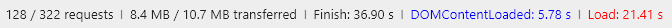

**SHRI-2018-homework-07**

Домашняя работа по теме "Performance"

# Анализ клиентской части сайта [Лайфхакер](https://lifehacker.ru/), рекомендации по улучшению скорости загрузки страницы.

1.  Протестируем загрузку главной страницы сайта (скорость 21Мбит/сек, десктопная версия):
  * Первый экран:
    + 
    + 
    + 
  * Вся страница:
    + 
    + 
    +   

Воспользуемся DevTools Audits для анализа. Согласно ему, первый полезный контент (тексты), отображается лишь на 13й секунде, а первые изображения лишь на 40й:  
  
    
2. Только первый экран требует чуть больше 3 Мб данных. Загрузка всей главной страницы требует более 10,5 Мб данных. При этом сжатие применяется лишь к небольшому числу ресурсов.   
Способ решения:
* более широкое применение сжатия данных, возможно применение различных способов сжатия к разным ресурсам - не только gzip и brotli, но и zopfli, sdch;
* минификация всех ресурсов, которые ей поддаются.

3. Загрузка данных для DOM наступает в среднем через 4-5 секунд для первого экрана и через 7-7,5 для всей страницы. Не смотря на то, что html передается через gzip. При этом в html много ненужного или повторяющего кода. К примеру, главное меню не переиспользуется, грубо говоря - оно не адаптивное. Есть отдельно разметка для десктопного меню и отдельно для мобильного, которая повторяет большую ее часть и весь набор списков ссылок. Это было бы лучше решить средствами css.  
Способ решения:
* изменение части css кода, использование приемов адаптивной верстки, перестроение блоков с помощью медиа-выражений;
* минификация html дала бы разницу в 80% - 1131 Кб -> 217 Кб.

4. Количество запросов для первого экрана - около 250, для всей страницы около 350. Это очень нерационально, ведь каждый запрос требует время на соединение. К примеру, css запрашивается 14 раз, javascript - 22 из разметки и всего на страницу около 120 раз.  
Способ решения: Многие запросы можно было бы объединить, конкатенировав несколько файлов с кодом в один, и уменьшить общее количество запросов.

5. Почти все скрипты, подключенные в разметку, запрашиваются не асинхронно, из 22 скриптов только 3. Согласно DevTools Audits, на загрузку всех скриптов уходит более 27 секунд, при этом многие из вообще не используются. Соответственно это тормозит всю остальную страницу.  
Способ решения: подгружать скрипты асинхронно, или хотя бы перенести в конец html, конкатенировать файлы, чтобы избежать ожидания при лишних запросах, использовать разные бандлы скриптов, из тех скриптов которые точно нужны, для разных страниц.

6. Очень много ресурсов подгружаются по протоколу http/1.1 - это порождает большую очередь загрузки, при таком количестве запросов это выливается в несколько секунд ожидания.  
Способ решения: грузить как можно большее количество ресурсов через протокол http/2

7. Изображения, на которые приходиться 80% всего веса страницы, никак не оптимизируются. Используется gif-изображения весом 0,5-2 Мб. Преобладающий формат изображения - jpeg, не является самым легким.  
Способ решения: использовать более экономичные по весу форматы. Например, webp, а jpeg оставить фолбеком для браузеров не поддерживающих этот формат. Средствами автоматизации очищать изображения от лишней встроенной информации и ужимать без потери качества.

8. Для адаптации изображений используется связка из javascript и html. Пример кода html:
```
<div data-src="https://cdn.lifehacker.ru/wp-content/uploads/2016/11/fitgirl_1479474339-1600x800.jpg"  
data-src-mobile="https://cdn.lifehacker.ru/wp-content/uploads/2016/11/fitgirl_1479474339-310x155.jpg" 
data-src-medium="https://cdn.lifehacker.ru/wp-content/uploads/2016/11/fitgirl_1479474339-630x315.jpg"  
data-src-ringo_800="https://cdn.lifehacker.ru/wp-content/uploads/2016/11/fitgirl_1479474339-800x400.jpg"  
data-src-ringo_1600="https://cdn.lifehacker.ru/wp-content/uploads/2016/11/fitgirl_1479474339-1600x800.jpg"  
style="background-image:  
url(&quot;https://cdn.lifehacker.ru/wp-content/uploads/2016/11/fitgirl_1479474339-630x315.jpg&quot;); 
opacity: 1;"  
class="stripe-item__img-background lazy-load"></div>
```
Javascript парсит html, и устанавливает изображение, подходящего для текущего размера экрана, как фон для div. Это плохое решение. Оно требует скачивания и запуска скрипта и дополнительных операций для каждой картинки в любом браузере. При этом при ресайзе окна, новое подходящее изображение не подгружается. Не учитываются ретиновые экраны. Это все влияет не только на скорость загрузки страницы, но и на ее качество в целом.  
Способ решения: использовать теги picture, source, img. Они позволят реализовать адаптивные изображения без js, а так же могут подстраиваться под изменение экрана и его разрешения. Также можно подключить полифил, который будет скачиваться только для браузеров, не поддерживающих picture, и не будет тормозить загрузку страницы во всех остальных.

9. Около 12 запросов приходиться на шрифты, подгружаемые с Google Fonts. При этом на странице используются лишь некоторые. Это тоже сказывается на загрузке.  
Способ решения: перенести css-код Gogle Fonts для нужных шрифтов в основной, перенести файлы шрифтов на сервер livehacker. Это ускорит его загрузку. Не погружать все шрифты на каждую страницу, если они на ней не используются. Для основных начертаний, используемых всегда, можно использовать предзагрузку.

10. Согласно DevTools Audits, более 60Кб css-стилей не используются на странице. В том числе стили для иконочного шрифта "font-awesome", хотя самого шрифта нет на странице. На их загрузку уходит более 1 секунды.  
Способ решения: составлять отдельные бандлы только из тех стилей, которые точно нужны, для разных типов страниц.

11. Согласно DevTools Perfomance, больше половины времени уходит на рендеринг страницы: 
  
Способ решения: чистка html (DevTools Audits - 2545 nodes, рекомендовано не более 1500), удаление лишнего взаимодействия с DOM из скриптов, в том числе отказ от использования document.write() (DevTools Audits).

12. На сайте использованы иконочные шрифты iconmoon. Они также требуют времени на загрузку.  
Способ решения: использовать svg-иконки. Если их объединить в svg-спрайт, то достаточно будет 1го запроса для загрузки (это секономит время, затрачиваемое на установку соединения). Также это позволит сократить html.

