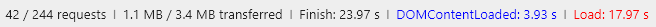

**SHRI-2018-homework-07**

Домашняя работа по теме "Performance"

# Анализ клиентской части сайта [Лайфхакер](https://lifehacker.ru/), рекомендации по улучшению скорости загрузки страницы.

I.  Рассмотрим основные показатели загрузки:
  * 
  * 
  * 
  
  